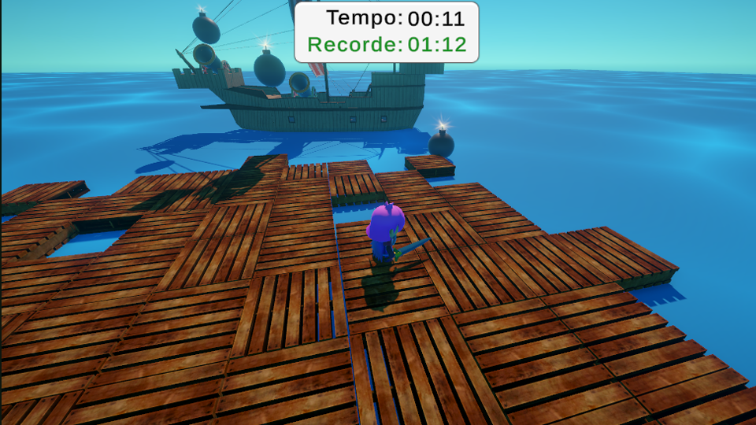
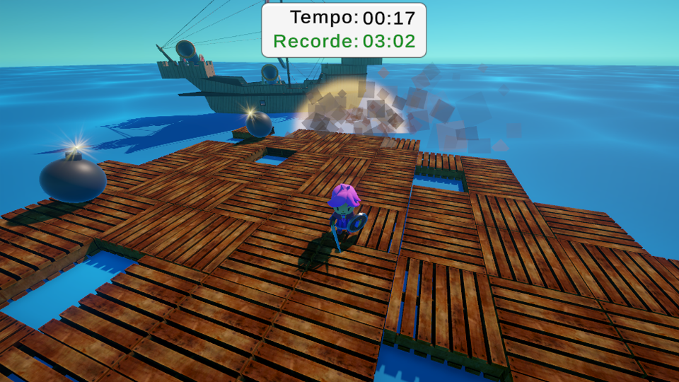

# Game

Clone do nível "Bombardment" do Stumble Guys

  
  

# Assets

O Jogo contém os asssets da Asset Store da Unity:

- [**RPG Tiny Hero Duo PBR Polyart** _by Dungeon Mason_](https://assetstore.unity.com/packages/3d/characters/humanoids/rpg-tiny-hero-duo-pbr-polyart-225148)
- [**Sailing Ships (14th/15th Century)** _by The Quantum Nexus_](https://assetstore.unity.com/packages/3d/vehicles/sea/sailing-ships-14th-15th-century-198426)
- [**Stylish Cannon Pack** _by StreakByte_](https://assetstore.unity.com/packages/3d/props/weapons/stylish-cannon-pack-174145)
- [**Particle Pack** _by Kenney_](https://opengameart.org/content/particle-pack-80-sprites)
- [**Wooden Pallet Pack** _by Pixel Games_](https://assetstore.unity.com/packages/3d/props/industrial/wooden-pallet-pack-657)
- Músicas por Kevin MacLeod: [incompetech.com](https://www.incompetech.com)
- Efeitos sonoros com licença pública obtidos em [freesound.org](https://freesound.org)
